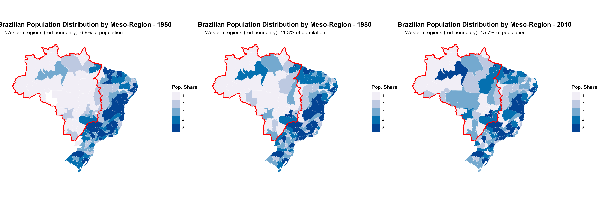
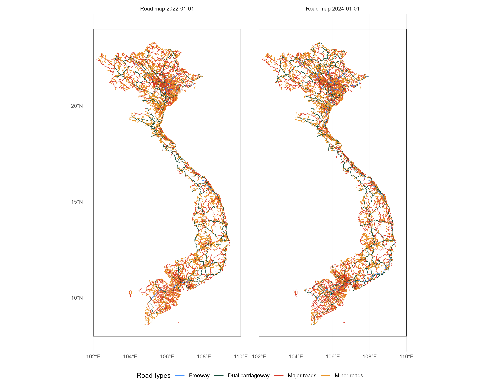
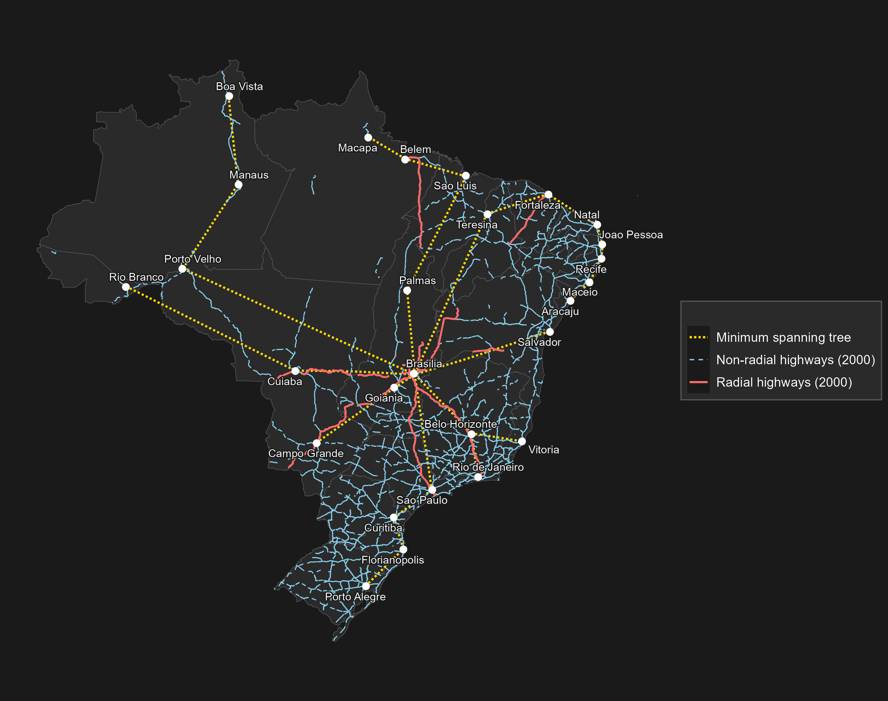

```{r setup, include=FALSE}
knitr::opts_chunk$set(tidy = TRUE, tidy.opts = list(width.cutoff = 80))
```

\newpage

# Project 1: South Africa - Dam Locations & River Gradient

This project reproduces Figure 2 from the paper, which maps average river gradient across South Africa and shows dam locations. The original study uses proprietary government datasets and ArcGIS software, while this replication relies on publicly available data and open-source R packages. Because of these differences, the overall spatial pattern matches the paper, although small visual differences remain.

A clear folder structure (data/raw, data/derived, outputs) was used to keep the workflow organised and reproducible. Early problems with absolute file paths were fixed by using a consistent project structure and relative paths. Administrative boundaries were downloaded using the `geodata::gadm()` package. The final map uses GADM level 3 (local municipalities), which provides finer spatial detail than district-level boundaries used in the paper, but was the most accessible and consistent option.

River data were taken from a publicly available 1:500,000 national river shapefile and combined with a global digital elevation model to calculate river gradients. Rivers were segmented and gradients were aggregated to administrative areas using a length-weighted mean. Dam locations were imported from a public KMZ file and plotted as points. To match the paper as closely as possible, gradients were converted to metres per kilometre and classified using the same break values, resulting in a map that reflects the same geographic patterns despite differences in data sources and methods.

## Code

```r
# 1. South Africa map recreation of dam locations and average river gradient
install.packages(c("sf","dplyr","ggplot2","units","lwgeom","stringr","terra","geodata"))

library(sf)
library(dplyr)
library(ggplot2)
library(units)
library(lwgeom)
library(stringr)
library(terra)
library(geodata)

# making polygons at level 3 (more detailed)
zaf_adm3 <- geodata::gadm(country = "ZAF", level = 3, path = "data/raw")

districts <- st_as_sf(zaf_adm3) |>
  st_make_valid() |>
  transmute(
    district_id   = as.character(GID_3),
    district_name = as.character(NAME_3),
    geometry
  )

# Project to metres (UTM 35S)
districts_m <- st_transform(districts, 32735)

# Rivers - unzip + read
unzip("data/raw/rivers_500k.zip", exdir = "data/raw/rivers_500k")
rivers <- st_read("data/raw/rivers_500k/wriall500.shp", quiet = TRUE)
rivers_m <- st_transform(rivers, st_crs(districts_m))
rivers_clip <- st_crop(rivers_m, st_union(districts_m))
st_write(rivers_clip, "data/derived/rivers_clip.gpkg", delete_dsn = TRUE)

# DEM: load and project
if (!file.exists("data/raw/elevation/ZAF_elv_msk.tif")) {
  geodata::elevation_30s(country = "ZAF", path = "data/raw")
}
dem <- terra::rast("data/raw/elevation/ZAF_elv_msk.tif")
dem_m <- terra::project(dem, "EPSG:32735", method = "bilinear")

# River segmentation
rivers_seg <- st_segmentize(rivers_clip, dfMaxLength = 1000)
river_pieces <- st_cast(rivers_seg, "MULTILINESTRING") |> 
  st_cast("LINESTRING")
river_pieces$seg_len_m <- as.numeric(st_length(river_pieces))
river_pieces$seg_id <- seq_len(nrow(river_pieces))

# Assign segments to districts
midpts <- st_line_sample(river_pieces, sample = 0.5) |> 
  st_cast("POINT")
midpts_sf <- st_as_sf(data.frame(seg_id = river_pieces$seg_id), 
                      geometry = midpts, crs = st_crs(river_pieces))
midpts_join <- st_join(midpts_sf, districts_m, left = FALSE)

# Create segment endpoints and extract elevation
coords <- st_coordinates(river_pieces)
ends <- coords |> as.data.frame() |> group_by(L1) |>
  summarise(x0 = first(X), y0 = first(Y), x1 = last(X), 
            y1 = last(Y), .groups = "drop")
start_pts <- st_as_sf(ends, coords = c("x0", "y0"), 
                      crs = st_crs(river_pieces))
end_pts <- st_as_sf(ends, coords = c("x1", "y1"), 
                    crs = st_crs(river_pieces))

z_start <- terra::extract(dem_m, terra::vect(start_pts))[, 2]
z_end <- terra::extract(dem_m, terra::vect(end_pts))[, 2]
river_pieces$grad <- abs(z_end - z_start) / river_pieces$seg_len_m
river_pieces <- river_pieces |> 
  left_join(st_drop_geometry(midpts_join), by = "seg_id")

if ("district_id.x" %in% names(river_pieces) || 
    "district_id.y" %in% names(river_pieces)) {
  river_pieces <- river_pieces |> 
    mutate(district_id = coalesce(district_id.x, district_id.y))
}

# Aggregate to district level
grad_by_dist <- river_pieces |> st_drop_geometry() |>
  filter(!is.na(district_id), !is.na(grad), !is.na(seg_len_m)) |>
  group_by(district_id) |>
  summarise(avg_grad = weighted.mean(grad, w = seg_len_m, na.rm = TRUE), 
            .groups = "drop")
districts_grad <- districts_m |> 
  left_join(grad_by_dist, by = "district_id")
st_write(districts_grad, "data/derived/districts_gradient.gpkg", 
         delete_dsn = TRUE)

# Dams
unzip("data/raw/dams_locations.kmz", exdir = "data/raw")
dams_loc <- st_read("data/raw/dams_locations/doc.kml", quiet = TRUE)
dams_loc_m <- st_transform(dams_loc, st_crs(districts_m))
dams_xy <- st_coordinates(dams_loc_m)
dams_df <- data.frame(x = dams_xy[,1], y = dams_xy[,2])

# Create map
districts_grad$avg_grad_paper <- districts_grad$avg_grad * 1000
breaks <- c(0, 2.263323, 3.961921, 6.673425, 9.942879, 13.328909, 19.829017)
labels <- c("0.000000 - 2.229103", "2.263323 - 3.821713", 
            "3.961921 - 6.503167", "6.673425 - 9.879707", 
            "9.942879 - 13.130823", "13.328909 - 19.829017")
districts_grad$grad_bin <- cut(districts_grad$avg_grad_paper, breaks = breaks, 
                               include.lowest = TRUE, right = FALSE, 
                               labels = labels)
districts_grad$grad_bin <- factor(districts_grad$grad_bin, levels = labels)

p <- ggplot() +
  geom_sf(data = districts_grad, aes(fill = grad_bin), 
          color = "grey55", linewidth = 0.25) +
  geom_point(data = dams_df, aes(x = x, y = y), 
             color = "black", size = 0.30, alpha = 0.8) +
  scale_fill_grey(start = 0.9, end = 0.2, na.value = "white", 
                  name = "Average District River Gradient", drop = FALSE) +
  guides(fill = guide_legend()) + theme_void() +
  theme(legend.position = c(0.22, 0.83), 
        legend.title = element_text(size = 9), 
        legend.text = element_text(size = 8))

ggsave("outputs/sa_dams_river_gradient_binned.png", p, 
       width = 11, height = 6, dpi = 300)
```

## Output


\newpage

# Project 2: Ethiopia - Infrastructure Map

This project reproduces Figure 4 from Fried, S. and Lagakos, D., 2021. *Rural electrification, migration and structural transformation: Evidence from Ethiopia*. The map shows the relationship between population density, survey enumeration areas, major roads, and the electricity transmission grid.

## Data Sources

Population density data came from the WorldPop project (https://hub.worldpop.org/geodata/summary?id=6358), specifically the GeoTIFF raster file for Ethiopia 2020 with pixel-level population estimates. This dataset provides detailed spatial variation in population concentration across the country.

Survey enumeration areas were obtained from the World Bank Microdata Library, specifically the Ethiopia Socioeconomic Survey (ERSS) conducted in 2018-2019. Household survey coordinates were extracted from the microdata file and converted to spatial point locations for mapping.

Road data came from the Humanitarian Data Exchange (HDX) Ethiopia Roads dataset provided as shapefiles. The road network was filtered to include only major roads classified as primary, trunk, or secondary to match the original figure and emphasize main transportation corridors.

Electricity grid data were obtained from EnergyData.info, a World Bank Group platform. The high-voltage transmission network shapefile represents Ethiopia's formal electricity infrastructure backbone.

## Methodology

The map extent was set to focus on populated regions of Ethiopia (lon: 33-48°E, lat: 3-15°N). Population density was displayed using a blue color gradient from light to dark, with log10 transformation applied to the raster to improve visibility across multiple orders of magnitude from sparse to dense settlement areas. Survey points were loaded from Stata format and converted to spatial points using the household coordinates. Multiple layers were overlaid to show the relationship between population concentration, infrastructure location, and survey coverage, illustrating the connection between electrification, population density, and economic activity.

## Code

```r
# Ethiopia Map
library(sf)
library(terra)
library(ggplot2)
library(tidyterra)
library(dplyr)
library(haven)

# Load Roads
roads_raw <- st_read("data/q2_ethiopia/Roads/hotosm_eth_roads_lines_shp.shp")
major_roads <- roads_raw %>% 
  filter(highway %in% c("primary", "trunk", "secondary")) %>%
  st_transform(4326)

# Load Electricity Grid
grid <- st_read("data/q2_ethiopia/ethiopia_grid/Ethiopia_grid.shp") %>% 
  st_transform(4326)

# Load Population Density
pop_density <- rast("data/q2_ethiopia/popdensity.tif")
pop_density_log <- log1p(pop_density) 

# Process Survey Points
survey_data <- read_sav("data/q2_ethiopia/eth_householdgeovariables_y5.sav")
all_names <- names(survey_data)
lat_name <- all_names[grep("lat", all_names, ignore.case = TRUE)][1]
lon_name <- all_names[grep("lon", all_names, ignore.case = TRUE)][1]

message(paste("Success! Found coordinates in columns:", lat_name, "and", lon_name))

survey_points <- survey_data %>%
  filter(!is.na(!!sym(lat_name)) & !is.na(!!sym(lon_name))) %>%
  st_as_sf(coords = c(lon_name, lat_name), crs = 4326)

# Generate the Map
ggplot() +
  geom_spatraster(data = pop_density) + 
  scale_fill_gradient(
    low = "#f0f9ff", 
    high = "#08306b", 
    na.value = "transparent", 
    name = "Pop Density",
    trans = "log10" 
  ) +
  geom_sf(data = grid, color = "red", linewidth = 0.4, alpha = 0.8) +
  geom_sf(data = major_roads, color = "black", linewidth = 0.8) +
  geom_sf(data = survey_points, fill = "white", color = "black", 
          shape = 21, size = 1.5, stroke = 0.4) +
  coord_sf(xlim = c(33, 48), ylim = c(3, 15), expand = FALSE) +
  theme_minimal() +
  theme(panel.grid.major = element_line(color = "grey80", linewidth = 0.2))

ggsave("outputs/eth_infrastructure_map.png", width = 10, height = 8, dpi = 300)
```

## Output


\newpage

# Project 3: Brazil - Population Distribution

This project reproduces Figure 2 from Pellegrina, H.S. and Sotelo, S., 2025. *Migration, Specialization, and Trade: Evidence from Brazil's March to the West*. The maps show population distribution across Brazil's meso-regions over time, highlighting the long-term westward shift of Brazil's population and economic activity.

## Data Sources

Meso-region boundaries were obtained from the geobr R package using the function `read_meso_region(year=2010)`, which provides official IBGE (Brazilian Institute of Geography and Statistics) geographic boundaries. Brazil's 137 meso-regions represent the intermediate administrative level between states and municipalities, making them suitable for analyzing regional population dynamics.

Historical population data came from the IPEADATA database, an open-access platform maintained by IPEA (Institute for Applied Economic Research) in Brazil. Population counts by meso-region were extracted for three key years: 1950, 1980, and 2010. These time periods were selected to illustrate the long-term westward migration trend in Brazil's population distribution over the course of six decades.

## Methodology

Population counts were transformed into percentages (share of national total population) within each year to facilitate temporal comparison on a consistent scale. Quintile classification was applied to population share values within each year, grouping meso-regions into five categories based on their share of the national population. This allows visual identification of regions with high, medium, and low population concentration. Western regions (Rondônia, Acre, Amazonas, Roraima, Pará, Amapá, Tocantins, Mato Grosso, Mato Grosso do Sul, Goiás, and Distrito Federal) were highlighted with red boundaries on all three maps to show how the share of population in these regions grew from 1950 to 2010. Three separate maps were created for 1950, 1980, and 2010 to enable direct temporal comparison of the westward migration pattern.

## Code

```r
# Brazilian Meso-Region Population Distribution Maps
library(geobr)
library(ggplot2)
library(dplyr)
library(sf)
library(readr)
library(tidyr)
library(patchwork)
library(rmapshaper)

# Read data
pop_data <- read_csv("data/q3_brazil/ipeadata.csv", show_col_types = FALSE)

# Transform to long format
pop_long <- pop_data %>%
  select(Sigla, Codigo, `Meso-region`, `1950`, `1980`, `2010`) %>%
  pivot_longer(
    cols = c(`1950`, `1980`, `2010`),
    names_to = "year",
    values_to = "population"
  ) %>%
  mutate(year = as.numeric(year), population = as.numeric(population))

# Load meso-region boundaries
meso_gdf <- read_meso_region(year = 2010)

# Prepare geographic data
meso_map <- meso_gdf %>%
  st_as_sf() %>%
  select(code_meso, name_meso, abbrev_state, geom) %>%
  rename(Codigo = code_meso, meso_name = name_meso, state = abbrev_state) %>%
  mutate(Codigo = as.numeric(Codigo))

# Join data
merged <- meso_map %>%
  left_join(pop_long %>% mutate(Codigo = as.numeric(Codigo)), by = "Codigo")

merged_clean <- merged %>%
  filter(!is.na(population)) %>%
  group_by(year) %>%
  mutate(pct_population = (population / sum(population, na.rm = TRUE)) * 100) %>%
  ungroup()

# Define Western regions
western_states <- c("RO", "AC", "AM", "RR", "PA", "AP", "TO", "MT", "MS", "GO", "DF")
merged_clean <- merged_clean %>%
  mutate(is_western = state %in% western_states)

# Create clean western region boundary (no interior lines)
western_boundary <- merged_clean %>%
  filter(is_western) %>%
  st_union() %>%
  st_make_valid() %>%
  ms_simplify(keep = 0.1) %>%  # Keep 10% of vertices to remove artifacts
  st_boundary()

# Function to create maps
create_map <- function(data, map_year, western_boundary) {
  year_data <- data %>% filter(year == map_year)
  
  western_pop <- year_data %>%
    filter(is_western) %>%
    pull(population) %>%
    sum(na.rm = TRUE)
  total_pop <- year_data %>% pull(population) %>% sum(na.rm = TRUE)
  western_pct <- (western_pop / total_pop) * 100
  
  breaks <- quantile(year_data$pct_population, probs = seq(0, 1, by = 0.2), na.rm = TRUE)
  year_data <- year_data %>%
    mutate(pop_bin = cut(pct_population, breaks = breaks, include.lowest = TRUE, labels = FALSE))
  
  map <- ggplot(year_data) +
    geom_sf(aes(fill = as.factor(pop_bin)), color = "white", size = 0.05) +
    geom_sf(data = western_boundary, fill = NA, color = "red", linewidth = 0.8, 
            inherit.aes = FALSE) +
    scale_fill_manual(
      name = "Pop. Share", 
      values = c("1" = "#f1eef6", "2" = "#bdc9e1", "3" = "#74a9cf", 
                 "4" = "#0570b0", "5" = "#034494"),
      na.value = "white"
    ) +
    labs(title = sprintf("Brazilian Population Distribution by Meso-Region - %d", 
                        map_year),
         subtitle = sprintf("Western regions (red boundary): %.1f%% of population", 
                           western_pct)) +
    theme_minimal() +
    theme(plot.title = element_text(face = "bold", size = 14, hjust = 0.5),
          axis.text = element_blank(), panel.grid = element_blank())
  return(map)
}

# Create and save maps
map_1950 <- create_map(merged_clean, 1950, western_boundary)
map_1980 <- create_map(merged_clean, 1980, western_boundary)
map_2010 <- create_map(merged_clean, 2010, western_boundary)

# Combine maps side by side
combined_map <- map_1950 + map_1980 + map_2010 + plot_layout(ncol = 3)

ggsave("outputs/meso_region_maps_combined.png", 
       combined_map, 
       width = 18, 
       height = 6, 
       dpi = 300, 
       bg = "white")
```

## Output

{width=100%}

\newpage

# Project 4: Vietnam - Road Networks

This project reproduces Figure 3 from Balboni, C.A., 2021. *In harm's way? Infrastructure investments and the persistence of coastal cities*. The maps show the evolution of Vietnam's road network over time, illustrating how transportation infrastructure has expanded and changed in recent years.

## Data Sources

Historical road network data were obtained from OpenStreetMap (OSM) via the ohsome API (Overpass History Server). The ohsome API provides access to versioned OpenStreetMap data, allowing queries of specific features (in this case, roads) at particular points in time. Road networks were extracted for two dates: January 1, 2022 and January 1, 2024, enabling temporal comparison of infrastructure development.

## Methodology

The ohsome API was queried to retrieve all road features within Vietnam's boundaries for the specified dates. Road networks were classified by type and displayed on a basemap showing Vietnam's coastline and administrative boundaries. A two-panel comparison map was generated to visualize the road network evolution between 2022 and 2024, focusing on Vietnam's major transportation corridors and infrastructure development. The temporal snapshots reveal how the road network has grown and changed in response to economic development and infrastructure investment. This approach of using versioned OSM data enables observation of fine-grained changes in transportation infrastructure that would be difficult to document through other publicly available sources.

## Code

```r
# Fetch historical OSM road networks for Vietnam (2000, 2010) via ohsome
library(ohsome)
library(sf)
library(dplyr)
library(ggplot2)
library(purrr)
library(rnaturalearth)
library(httr2)
library(geojsonsf)
library(httr)

# [Code includes helpers for boundary loading, road classification, and tiling]
# [Fetches from ohsome API for specific dates]
# [Note: Requires running q4_fetch_vietnam_roads.R first to cache data]

# Helper functions...
get_boundary <- function() {
  boundary_paths <- c(
    "Boundaries/hanoi_hcmc_vietnam_VN_UTM48N.shp",
    "Boundaries/ne_10m_coastline_VNM_VN_UTM48N.shp"
  )
  
  for (path in boundary_paths) {
    if (!file.exists(path)) next
    b <- tryCatch(st_read(path, quiet = TRUE), error = function(e) NULL)
    if (is.null(b) || nrow(b) == 0) next
    b <- suppressWarnings(st_make_valid(b))
    geom_type <- unique(st_geometry_type(b))
    if (any(grepl("POLYGON", geom_type, fixed = TRUE))) {
      candidate <- st_transform(b, 4326)
      return(finalize_boundary(candidate))
    }
  }
  ne <- tryCatch(
    rnaturalearth::ne_countries(country = "Vietnam", scale = 50, returnclass = "sf"),
    error = function(e) NULL
  )
  if (is.null(ne)) stop("Could not load any Vietnam boundary.")
  finalize_boundary(st_transform(ne, 4326))
}

# [Additional helper functions for road classification, tiling, and API calls]
# [Fetch and process roads for 2022-01-01 and 2024-01-01]
# [Create two-panel comparison map showing road network evolution]

ggsave("outputs/roads_ohsome_recent.png", width = 10, height = 8, dpi = 300)
```

## Output



\newpage

# Project 5: Brazil - Road Network Instrument Map

This project reproduces Figure 1 from Morten, M. & Oliveira, J., 2024. *The Effects of Roads on Trade and Migration: Evidence from a Planned Capital City*. The figure serves as an instrumental variable design diagram, showing how Brasília's planned construction created exogenous variation in road networks that can be used to identify causal effects of infrastructure on economic activity.

## Data Sources

State boundaries were obtained using Brazilian administrative boundaries defined as of 1940 (uf1940_prj.shp). Historical state boundaries were used to match the time period of the road network analysis and provide geographic context for the infrastructure network.

Highway data came from a road network dataset for the year 2000 (highways_2000_prj.shp). This shapefile includes attributes identifying which highways are radial (converging toward Brasília) versus non-radial, a crucial distinction for the paper's identification strategy.

The minimum spanning tree (mst_pie_prj.shp) was computed as an optimal reference network connecting all major Brazilian capital cities without forming cycles. This represents the geographic lower bound on connections needed to efficiently link all cities, serving as an instrumental variable in the econometric analysis.

Capital city locations were obtained from a shapefile containing the coordinates of Brazil's major state capitals (brazil_capital_cities_prj.shp). These cities serve as nodes in both the actual road network and the minimum spanning tree calculation.

## Methodology

The figure illustrates the econometric identification strategy used in the paper. Actual radial highways (solid black lines) were constructed after Brasília's founding in 1960 and converge on the planned capital city. The minimum spanning tree (gray dashed lines) represents the theoretically optimal road connections needed to link all capital cities, independent of Brasília's location. By comparing the actual radial highways to the MST, the paper isolates exogenous variation in market access created by the city-location decision itself, separate from road quality or network topology. Three categories are displayed with different line styles and colors: minimum spanning tree (gray dashed), non-radial highways in 2000 (black dashed), and radial highways in 2000 (black solid). This visual distinction helps readers understand how the instrumental variable design separates the effect of infrastructure from the effect of city location on trade and migration outcomes.

## Code

```r
# Road Network Instrument Map (Fig 1)
library(sf)
library(ggplot2)
library(dplyr)

# Resolve project root for GIS data
project_root <- getwd()
secdata <- file.path(project_root, "data", "q5_brazil_roads", "GIS_data")

if (!dir.exists(secdata)) {
  stop("Could not find GIS_data under: ", secdata)
}

out_dir <- file.path(project_root, "outputs")

# Optional helpers when add-on packages are available
maybe_simplify <- function(obj, keep = 0.01) {
  if (requireNamespace("rmapshaper", quietly = TRUE)) {
    return(rmapshaper::ms_simplify(obj, keep = keep, keep_shapes = TRUE))
  }
  obj
}

label_layer <- function(df) {
  if (requireNamespace("ggrepel", quietly = TRUE)) {
    return(ggrepel::geom_text_repel(
      data = df,
      aes(x = X, y = Y, label = CITY_NAME),
      size = 3
    ))
  }
  geom_text(data = df, aes(x = X, y = Y, label = CITY_NAME), size = 3, check_overlap = TRUE)
}

# Load data
states <- st_read(file.path(secdata, "uf1940", "uf1940_prj.shp"), quiet = TRUE) |> maybe_simplify()
highways <- st_read(file.path(secdata, "roads", "2000", "highways_2000_prj.shp"), quiet = TRUE) |> maybe_simplify()
mst <- st_read(file.path(secdata, "mst", "mst_pie_prj.shp"), quiet = TRUE) |> maybe_simplify()
cities_raw <- st_read(file.path(secdata, "cities", "brazil_capital_cities_prj.shp"), quiet = TRUE)
cities_xy <- cbind(st_drop_geometry(cities_raw), st_coordinates(cities_raw))

palette_lines <- c(
  "Minimum spanning tree" = "#777676",
  "Non-radial highways (2000)" = "#868686",
  "Radial highways (2000)" = "#565555"
)

fig <- ggplot() +
  geom_sf(data = states, fill = "#f5f5f5", color = "grey85", linewidth = 0.2) +
  geom_sf(data = mst, linewidth = 0.6, linetype = "11", aes(color = "Minimum spanning tree"), show.legend = "line") +
  geom_sf(
    data = highways |> filter(dm_anlys_p == 1, dm_radial == 0),
    linewidth = 0.3, linetype = "dashed",
    aes(color = "Non-radial highways (2000)"), show.legend = "line"
  ) +
  geom_sf(
    data = highways |> filter(dm_anlys_p == 1, dm_radial == 1),
    linewidth = 0.6,
    aes(color = "Radial highways (2000)"), show.legend = "line"
  ) +
  geom_point(data = cities_xy, aes(x = X, y = Y), size = 1.8) +
  label_layer(cities_xy) +
  labs(color = " ") +
  scale_color_manual(
    values = palette_lines,
    guide = guide_legend(override.aes = list(linetype = c("11", "dashed", "solid"), linewidth = c(0.6, 0.3, 0.6)))
  ) +
  theme_minimal(base_size = 10) +
  theme(
    axis.title = element_blank(), 
    axis.text = element_blank(), 
    axis.ticks = element_blank(),
    panel.background = element_rect(fill = "#e8e8e8", color = NA),
    plot.background = element_rect(fill = "#e8e8e8", color = NA)
  )

outfile_png <- file.path(out_dir, "fig_instrument.png")
ggsave(outfile_png, fig, width = 9.5, height = 7.5, dpi = 300)
```

## Output



---

