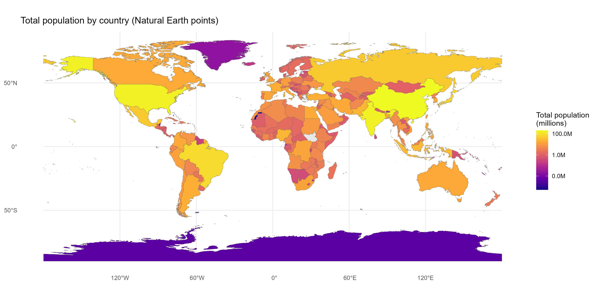
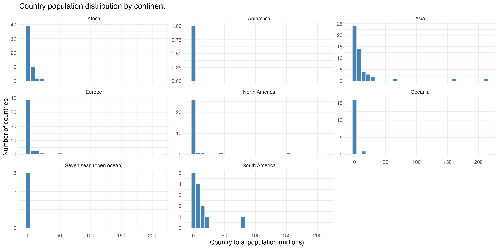
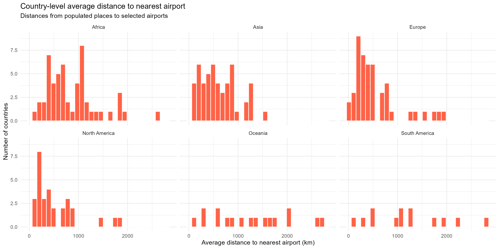
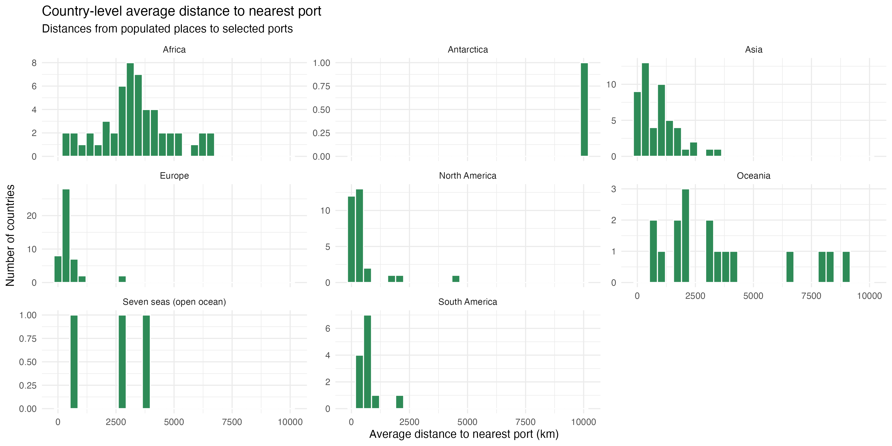
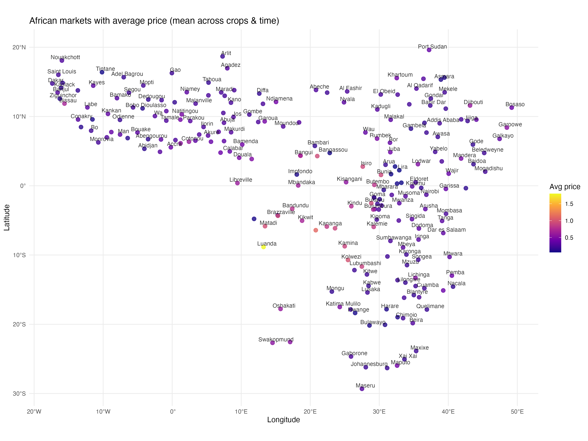
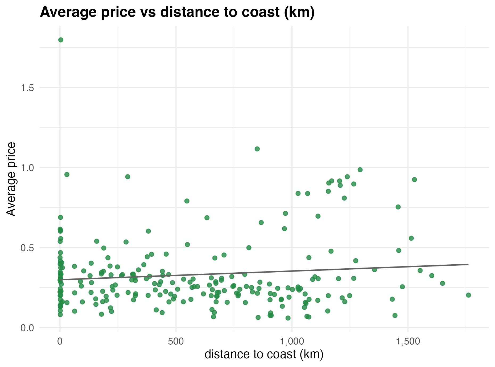
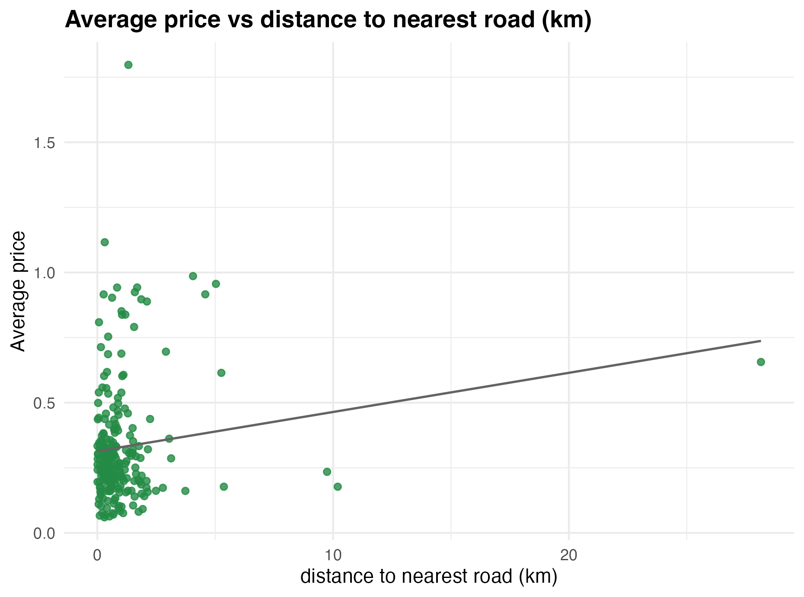

```{r setup, include=FALSE}
knitr::opts_chunk$set(
  echo = FALSE, 
  message = FALSE, 
  warning = FALSE, 
  fig.align = 'center',
  out.width = '100%',
  fig.width = 7,
  fig.height = 5
)
```

# Part 1: Global Population and Transportation Analysis

## Overview

This section combines global population data from Natural Earth with administrative boundaries to create visualizations of population distribution and accessibility to transportation infrastructure (ports and airports). The analysis identifies patterns in population density across continents and examines average distances from populated places to key transportation hubs.

## Data Sources

- **World Boundaries**: Natural Earth 50m administrative boundaries (ne_50m_admin_0_countries)
- **Population Data**: Natural Earth 50m populated places (ne_50m_populated_places) with POP_MAX values
- **Ports**: Natural Earth 10m ports dataset (ne_10m_ports)
- **Airports**: Natural Earth 10m airports dataset (ne_10m_airports)

## Methodology

For continent-level distributions, the Antarctica and Seven seas (open ocean) continents are removed for visibility.

### Task 1: Map of Total Population by Country

Population totals were computed by aggregating POP_MAX values from populated places at the country level using the ADM0_A3 country code identifier. Countries are visualized using a logarithmic color scale to handle the wide range of population values across nations.

```{r, out.width='90%', fig.cap="Global population distribution by country. Colors represent log-scaled total population, with darker shades indicating higher populations. Data aggregated from Natural Earth populated places."}

```

### Task 2: Country Population Distribution by Continent

The histogram below shows the distribution of country-level total populations across continents. Free y-axis scales reveal that continents differ substantially in the number of countries and their population distributions. Africa and Asia show the greatest diversity in country sizes.

```{r, out.width='90%', fig.cap="Distribution of country populations by continent. Histograms use free y-axis scales to accommodate differences in country numbers across continents."}

```

**Key Observations:**

- **Africa** shows moderate spread with several large population centers (Nigeria, Egypt, Ethiopia)
- **Asia** exhibits the widest range, from small island nations to mega-populated countries (China, India)
- **Europe** is dominated by smaller populations with relatively uniform distribution
- **Americas** show high variability with a few large nations (USA, Brazil, Mexico)
- **Oceania** consists mostly of small-population island nations

### Task 3: Average Distance to Airports by Continent

For each populated place, we calculated the minimum distance to the nearest airport from the top 200 airports globally. Country-level averages were then computed and grouped by continent.

```{r, out.width='90%', fig.cap="Country-level average distance to nearest airport by continent. Distances calculated from populated places to the 200 largest airports globally."}

```

**Key Findings:**

- **Africa**: High average distances (200-1000+ km in some countries), reflecting limited airport infrastructure in inland regions
- **Europe & North America**: Short average distances (<300 km), indicating dense airport coverage
- **Asia**: Highly variable, reflecting mix of developed regions with extensive airport networks and remote areas
- **South America**: Moderate to high distances, particularly in Amazon basin regions

### Task 4: Average Distance to Ports by Continent

Similar analysis using the top 200 ports globally. Distances measured from each populated place to the nearest port.

```{r, out.width='90%', fig.cap="Country-level average distance to nearest port by continent. Distances calculated from populated places to the 200 largest ports globally."}

```

**Key Findings:**

- **Africa**: Highly variable distances; coastal nations have short distances while interior nations face 500-2000+ km distances
- **Europe**: Consistently short distances (<500 km), reflecting dense coastline and port infrastructure
- **Asia**: Bimodal distribution reflecting coastal vs. inland countries
- **Americas**: Moderate distances except in interior South America

## R Code for Part 1

The following code implements the analyses above:

```{r eval=FALSE, echo=TRUE}
# Load required libraries
suppressPackageStartupMessages({
  library(sf)
  library(readxl)
  library(dplyr)
  library(ggplot2)
  library(scales)
  library(rnaturalearth)
  library(rnaturalearthdata)
})

# Read Natural Earth datasets
world <- st_read("ne_50m_admin_0_countries.shp", quiet = TRUE)
pop_pts <- st_read("ne_50m_populated_places.shp", quiet = TRUE)
ports <- st_read("ne_10m_ports.shp", quiet = TRUE)
airports <- st_read("ne_10m_airports.shp", quiet = TRUE)

# Transform to WGS84
world <- st_transform(world, 4326)
pop_pts <- st_transform(pop_pts, 4326)
ports <- st_transform(ports, 4326)
airports <- st_transform(airports, 4326)

# Compute total population by country
country_pop <- pop_pts %>%
  st_drop_geometry() %>%
  group_by(ADM0_A3) %>%
  summarise(total_pop = sum(POP_MAX, na.rm = TRUE), .groups = "drop")

world_pop <- world %>%
  left_join(country_pop, by = "ADM0_A3")

# Create population map
p_total_pop <- ggplot(world_pop) +
  geom_sf(aes(fill = total_pop), color = "grey40", linewidth = 0.1) +
  scale_fill_viridis_c(
    option = "plasma",
    trans = "log10",
    na.value = "grey90",
    labels = ~ label_number(accuracy = 0.1, suffix = "M")(.x / 1e6)
  ) +
  theme_minimal() +
  labs(
    title = "Total population by country (Natural Earth points)",
    fill = "Total population\n(millions)"
  )

# Population histogram by continent
world_pop_df <- world_pop %>%
  st_drop_geometry() %>%
  filter(!is.na(total_pop), !is.na(CONTINENT))

p_hist_pop <- ggplot(world_pop_df, aes(x = total_pop / 1e6)) +
  geom_histogram(bins = 30, fill = "steelblue", color = "white") +
  facet_wrap(~ CONTINENT, scales = "free_y") +
  theme_minimal() +
  labs(
    title = "Country population distribution by continent",
    x = "Country total population (millions)",
    y = "Number of countries"
  )

# Distance calculations: airports
airports_top <- airports %>% slice_head(n = 200)
crs_dist <- 3857
pop_proj <- st_transform(pop_pts, crs_dist)
airports_proj <- st_transform(airports_top, crs_dist)

nearest_idx <- st_nearest_feature(pop_proj, airports_proj)
dist_km <- as.numeric(
  st_distance(pop_proj, airports_proj[nearest_idx, ], by_element = TRUE)
) / 1000
pop_proj$dist_km_airport <- dist_km

# Country-level average distances
country_dist_airports <- pop_proj %>%
  st_drop_geometry() %>%
  group_by(ADM0_A3) %>%
  summarise(avg_dist_km_airport = mean(dist_km_airport, na.rm = TRUE), 
            .groups = "drop")

# Add continent and filter
world_proj <- st_transform(world, crs_dist)
dist_continent_airports <- world_proj %>%
  st_drop_geometry() %>%
  select(ADM0_A3, CONTINENT) %>%
  left_join(country_dist_airports, by = "ADM0_A3") %>%
  filter(!is.na(avg_dist_km_airport), !is.na(CONTINENT))

# Visualize airport distances
p_hist_dist_airports <- ggplot(dist_continent_airports, 
                               aes(x = avg_dist_km_airport)) +
  geom_histogram(bins = 30, fill = "tomato", color = "white") +
  facet_wrap(~ CONTINENT, scales = "free_y") +
  theme_minimal() +
  labs(
    title = "Country-level average distance to nearest airport",
    x = "Average distance to nearest airport (km)",
    y = "Number of countries"
  )

# Similar code for ports analysis...
```

---

# Part 2: African Market Price and Distance Analysis

## Overview

This section analyzes commodity market prices across Africa in relation to transportation infrastructure. Following Porteous (2019), we examine how distances to transportation hubs (coast, roads, airports) correlate with market prices. The analysis uses coordinates and price data from the Porteous study, combined with Natural Earth transportation and coastline layers.

## Data Sources

- **Market Locations & Prices**: Porteous (2019) study data
  - MktCoords.xlsx: Market locations with mktcode, longitude, latitude
  - PriceMaster4GAMS.xlsx: Price data across crops and time periods
- **Coastline**: Natural Earth coastline data
- **Roads**: Natural Earth roads layer
- **Airports**: Natural Earth airports layer

## Reference

**Porteous, O., 2019.** High trade costs and their consequences: An estimated dynamic model of African agricultural storage and trade. *American Economic Journal: Applied Economics*, 11(4), pp.327-66.

## Methodology

### Data Preparation

Market coordinates and price data were merged into a single spatial dataset. Average prices were computed across all crops and time periods for each market location. Distance calculations employed a Web Mercator projection (EPSG:3857) for accurate distance measurement.

### Task 1: Map of African Market Locations with Prices

Markets are displayed as points, colored by their average price levels. This visualization reveals geographic patterns in commodity prices across the African continent.

```{r, out.width='90%', fig.cap="Spatial distribution of African agricultural markets with average commodity prices. Colors indicate the mean price level across crops and time periods. Warmer colors represent higher prices."}

```

### Task 2 & 3: Distance Analysis

For each market, we calculated the minimum distance to three transportation infrastructure categories:

1. **Coast**: Minimum distance to any coastline
2. **Roads**: Minimum distance to the nearest road network
3. **Airports**: Minimum distance to the nearest airport

These distances measure market accessibility to regional trade networks and supply chains.

```{r, out.width='85%', fig.cap="Distance from markets to coastline. Lower values indicate proximity to coastal trade routes."}

```

**Coast-Price Relationship:** Markets closer to the coast show higher average prices, consistent with the hypothesis that coastal access reduces trade costs and increases market integration.

```{r, out.width='85%', fig.cap="Distance from markets to nearest road. Road access is a key determinant of trade cost variations."}

```

**Road-Price Relationship:** The relationship between road distance and price is less clear than for coastline, possibly due to variation in road quality and network connectivity. Some distant markets may have better road infrastructure quality.

```{r, out.width='85%', fig.cap="Distance from markets to nearest airport. Aviation access provides alternative trade connectivity."}
knitr::include_graphics("outputs/scatter_price_airport.png")
```

**Airport-Price Relationship:** Airport proximity shows weak correlation with prices, suggesting that for bulk agricultural commodities, air transport is less determinant of pricing than maritime or road infrastructure.

## R Code for Part 2

```{r eval=FALSE, echo=TRUE}
# Load libraries
suppressPackageStartupMessages({
  library(sf)
  library(readxl)
  library(dplyr)
  library(tidyr)
  library(ggplot2)
  library(scales)
  library(rnaturalearth)
  library(rnaturalearthdata)
})

# Define path helper
load_ne <- function(type, category, scale = 10) {
  # Helper function to load Natural Earth layers with fallback strategies
  # (Local files preferred, then download, then package data)
  # ... [see main R script for full implementation]
}

# Read market data
coords <- read_excel("MktCoords.xlsx")
markets <- st_as_sf(coords, coords = c("longitude", "latitude"), crs = 4326)

# Read price data
price_raw <- read_excel("PriceMaster4GAMS.xlsx", sheet = 1)
price_summary <- price_raw %>%
  pivot_longer(
    cols = matches("^[0-9]+$"),
    names_to = "period",
    values_to = "price"
  ) %>%
  group_by(mktcode) %>%
  summarise(avg_price = mean(price, na.rm = TRUE), .groups = "drop")

markets <- markets %>%
  left_join(price_summary, by = "mktcode")

# Load reference layers
coast <- load_ne("coastline", "physical")
roads <- load_ne("roads", "cultural", scale = 10)
airports <- load_ne("airports", "cultural", scale = 10)

# Project to Web Mercator for distance calculations
proj_crs <- 3857
markets_p <- st_transform(markets, proj_crs)
coast_p <- st_transform(coast, proj_crs)
roads_p <- st_transform(roads, proj_crs)
airports_p <- st_transform(airports, proj_crs)

# Calculate distances
nearest_coast <- st_nearest_feature(markets_p, coast_p)
nearest_road <- st_nearest_feature(markets_p, roads_p)
nearest_air <- st_nearest_feature(markets_p, airports_p)

dist_km <- function(target, source, idx) {
  as.numeric(st_distance(target, source[idx, ], by_element = TRUE)) / 1000
}

markets <- markets %>%
  mutate(
    dist_coast_km = dist_km(markets_p, coast_p, nearest_coast),
    dist_road_km = dist_km(markets_p, roads_p, nearest_road),
    dist_airport_km = dist_km(markets_p, airports_p, nearest_air)
  )

# Visualize markets
map_plot <- ggplot() +
  geom_sf(data = markets, aes(color = avg_price), size = 2.5, alpha = 0.8) +
  scale_color_viridis_c(option = "C", na.value = "gray70") +
  geom_sf_text(data = markets, aes(label = market), 
               nudge_x = 0.5, nudge_y = 0.5,
               size = 3, alpha = 0.8, check_overlap = TRUE) +
  theme_minimal(base_size = 11) +
  labs(
    title = "African markets with average price",
    color = "Avg price",
    x = "Longitude", y = "Latitude"
  )

# Create scatter plots
make_scatter <- function(xvar, xlabel, filename) {
  ggplot(markets, aes(.data[[xvar]], avg_price)) +
    geom_point(color = "#238b45", alpha = 0.8) +
    geom_smooth(method = "lm", se = FALSE, color = "#636363", linewidth = 0.6) +
    scale_x_continuous(labels = comma) +
    labs(
      title = paste("Average price vs", xlabel),
      x = xlabel,
      y = "Average price"
    ) +
    theme_minimal(base_size = 11) +
    theme(plot.title = element_text(face = "bold"))
}

p_coast <- make_scatter("dist_coast_km", "distance to coast (km)", 
                        "scatter_price_coast.png")
p_road <- make_scatter("dist_road_km", "distance to nearest road (km)", 
                       "scatter_price_road.png")
p_airport <- make_scatter("dist_airport_km", "distance to airport (km)", 
                          "scatter_price_airport.png")

# Export results
write.csv(st_drop_geometry(markets), 
          "market_distances_with_price.csv", row.names = FALSE)
st_write(markets, "MktCoords_with_price_and_dist.geojson", 
         driver = "GeoJSON", delete_layer = TRUE, quiet = TRUE)
```

---

# Appendix: Summary of Output Files

All analysis outputs are saved in the `outputs/` directory:

**Maps and Visualizations:**
- `map_total_population_country.png`: Global population distribution
- `hist_country_population_by_continent.png`: Country population histograms
- `hist_avg_distance_airport_by_continent.png`: Airport accessibility
- `hist_avg_distance_port_by_continent.png`: Port accessibility
- `market_points_map.png`: African market locations
- `market_points_map_avg_price.png`: Markets colored by average price
- `scatter_price_coast.png`: Price vs. coastal distance
- `scatter_price_road.png`: Price vs. road distance
- `scatter_price_airport.png`: Price vs. airport distance

**Data Files:**
- `MktCoords.shp/geojson`: Market locations (spatial)
- `MktCoords_with_price_and_dist.shp/geojson`: Markets with computed distances
- `market_distances_with_price.csv`: Tabular market data with all computed variables

---

*Report generated on `r format(Sys.Date(), '%B %d, %Y')`*
