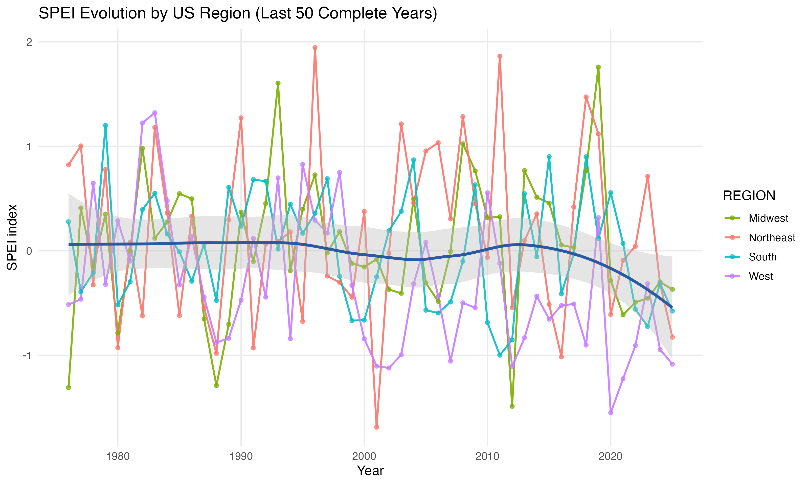
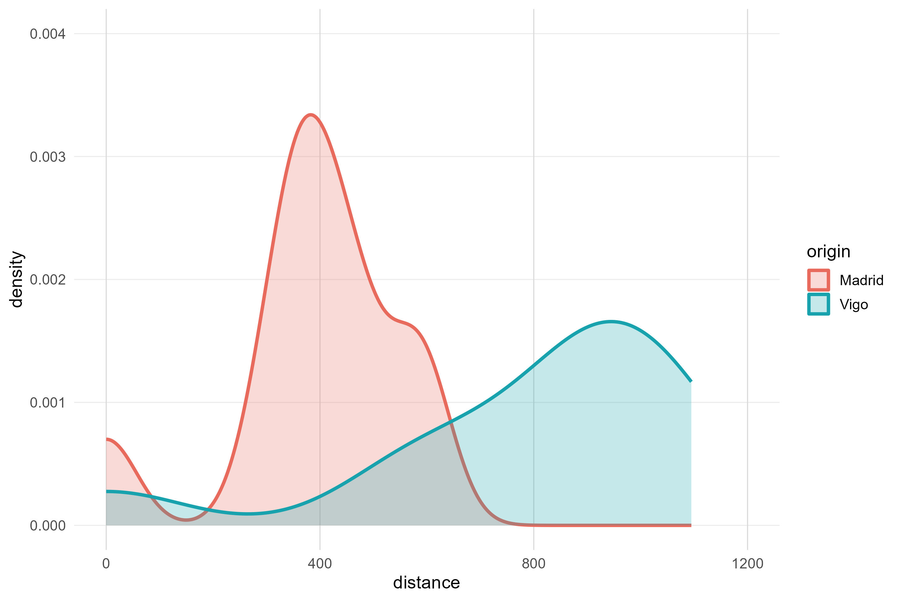
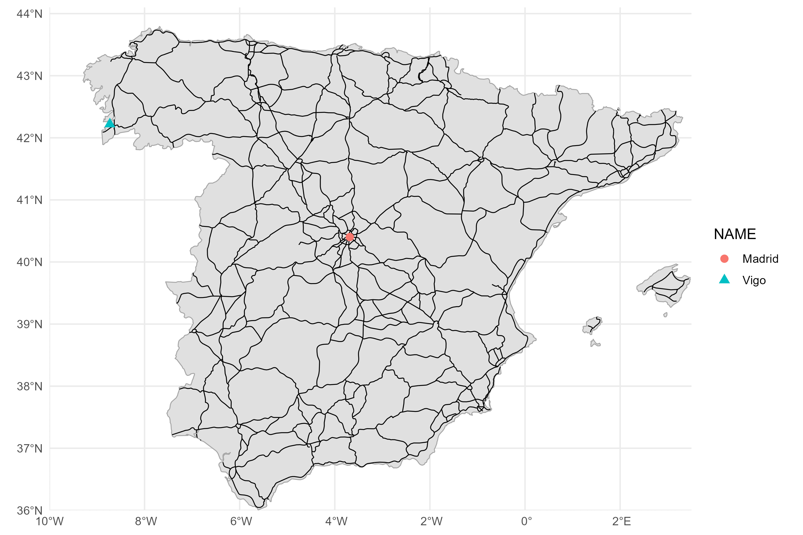

---
output:
  pdf_document: default
  html_document: default
---
# Take-Home Assignment 3

author: "Samuel Gerard Fraley, Selve Rajayogan, Victor Ruiz Perez, Xianrui Cao"

## A1: Climate Change in the USA

The goal is to visualize SPEI (Standardized Precipitation-Evapotranspiration Index) trends over the last 50 years across US census regions. SPEI is a drought index — negative values indicate drier-than-normal conditions.

US states are loaded from Natural Earth and dissolved into four census regions (Northeast, Midwest, South, West). The SPEI-12 NetCDF from NOAA nClimGrid is then extracted by region, averaged to annual values, and plotted.

```r
required_packages <- c("sf", "dplyr", "ggplot2", "terra", "tidyr", "stringr")
missing_packages <- required_packages[
  !vapply(required_packages, requireNamespace, logical(1), quietly = TRUE)
]
if (length(missing_packages) > 0) {
  install.packages(missing_packages, repos = "https://cloud.r-project.org")
}
invisible(lapply(required_packages, library, character.only = TRUE))

detect_script_dir <- function() {
  args <- commandArgs(trailingOnly = FALSE)
  file_arg <- grep("^--file=", args, value = TRUE)
  if (length(file_arg) > 0) {
    script_path <- sub("^--file=", "", file_arg[1])
    return(dirname(normalizePath(script_path)))
  }
  if (requireNamespace("rstudioapi", quietly = TRUE)) {
    editor_path <- tryCatch(rstudioapi::getSourceEditorContext()$path, error = function(e) "")
    if (nzchar(editor_path)) {
      return(dirname(normalizePath(editor_path)))
    }
  }
  normalizePath("a3/scripts", mustWork = FALSE)
}

load_us_states <- function(data_dir) {
  states_zip <- file.path(data_dir, "ne_10m_admin_1_states_provinces.zip")
  states_url <- paste0(
    "https://naciscdn.org/naturalearth/10m/cultural/",
    "ne_10m_admin_1_states_provinces.zip"
  )
  if (!file.exists(states_zip)) {
    message("Downloading Natural Earth admin-1 states shapefile...")
    tryCatch(
      download.file(states_url, states_zip, mode = "wb"),
      error = function(e) {
        stop(
          "Could not download US states data. ",
          "Place ne_10m_admin_1_states_provinces.zip in: ", data_dir, "\n",
          "Reason: ", conditionMessage(e)
        )
      }
    )
  }
  states_vsi <- paste0("/vsizip/", states_zip, "/ne_10m_admin_1_states_provinces.shp")
  states_raw <- sf::st_read(states_vsi, quiet = TRUE)
  if ("adm0_a3" %in% names(states_raw)) {
    states_raw <- states_raw %>% filter(adm0_a3 == "USA")
  } else if ("admin" %in% names(states_raw)) {
    states_raw <- states_raw %>% filter(admin == "United States of America")
  } else {
    stop("Could not find a country-identification field in the states data.")
  }
  states_raw
}

build_us_regions <- function(us_states) {
  region_lookup <- data.frame(
    postal = c(
      "CT", "ME", "MA", "NH", "NJ", "NY", "PA", "RI", "VT",
      "IL", "IN", "MI", "OH", "WI", "IA", "KS", "MN", "MO", "NE", "ND", "SD",
      "DE", "FL", "GA", "MD", "NC", "SC", "VA", "DC", "WV", "AL", "KY", "MS",
      "TN", "AR", "LA", "OK", "TX",
      "AZ", "CO", "ID", "MT", "NV", "NM", "UT", "WY", "AK", "CA", "HI", "OR", "WA"
    ),
    census_region = c(
      rep("Northeast", 9), rep("Midwest", 12), rep("South", 17), rep("West", 13)
    ),
    stringsAsFactors = FALSE
  )
  states_with_region <- us_states %>%
    mutate(postal = toupper(as.character(postal))) %>%
    inner_join(region_lookup, by = "postal") %>%
    select(postal, census_region, geometry) %>%
    group_by(postal, census_region) %>%
    summarise(do_union = TRUE, .groups = "drop")
  states_with_region %>%
    group_by(census_region) %>%
    summarise(do_union = TRUE, .groups = "drop") %>%
    rename(region = census_region)
}

parse_layer_dates <- function(r) {
  tvals <- terra::time(r)
  if (!is.null(tvals) && length(tvals) == terra::nlyr(r) && !all(is.na(tvals))) {
    return(as.Date(tvals))
  }
  layer_names <- names(r)
  dates <- suppressWarnings(as.Date(gsub(
    "\\.", "-",
    stringr::str_extract(layer_names, "\\d{4}[.-]\\d{2}[.-]\\d{2}")
  )))
  missing_idx <- is.na(dates)
  if (any(missing_idx)) {
    ym <- stringr::str_extract(layer_names[missing_idx], "\\d{4}[.-]\\d{2}")
    dates[missing_idx] <- suppressWarnings(as.Date(paste0(gsub("\\.", "-", ym), "-15")))
  }
  missing_idx <- is.na(dates)
  if (any(missing_idx)) {
    yyyymm <- stringr::str_extract(layer_names[missing_idx], "(19|20)\\d{2}(0[1-9]|1[0-2])")
    dates[missing_idx] <- suppressWarnings(as.Date(paste0(
      substr(yyyymm, 1, 4), "-", substr(yyyymm, 5, 6), "-15"
    )))
  }
  if (anyNA(dates)) stop("Could not parse layer dates from SPEI raster names.")
  dates
}

build_panel_from_spei_nc <- function(spei_nc, us_regions) {
  if (!file.exists(spei_nc)) stop("SPEI NetCDF file not found: ", spei_nc)
  spei_rast <- terra::rast(spei_nc)
  us_regions_aligned <- sf::st_transform(us_regions, terra::crs(spei_rast))
  extracted <- terra::extract(spei_rast, terra::vect(us_regions_aligned), fun = mean, na.rm = TRUE)
  layer_names <- names(spei_rast)
  names(extracted)[-1] <- layer_names
  date_map <- data.frame(layer = layer_names, date = parse_layer_dates(spei_rast), stringsAsFactors = FALSE)
  panel_monthly <- extracted %>%
    mutate(region = us_regions_aligned$region) %>%
    select(-ID) %>%
    tidyr::pivot_longer(cols = -region, names_to = "layer", values_to = "spei") %>%
    left_join(date_map, by = "layer") %>%
    mutate(year = as.integer(format(date, "%Y")), month = as.integer(format(date, "%m")))
  complete_years <- panel_monthly %>%
    filter(!is.na(spei)) %>%
    group_by(year) %>%
    summarise(n_months = n_distinct(month), .groups = "drop") %>%
    filter(n_months == 12) %>%
    pull(year)
  if (length(complete_years) == 0) stop("No complete years (12 months) found in extracted SPEI data.")
  end_year <- max(complete_years)
  start_year <- end_year - 49
  panel_monthly %>%
    filter(year >= start_year, year <= end_year) %>%
    group_by(region, year) %>%
    summarise(spei = mean(spei, na.rm = TRUE), .groups = "drop") %>%
    arrange(region, year)
}

is_valid_spei_nc <- function(path) {
  if (!file.exists(path)) return(FALSE)
  file_info <- file.info(path)
  if (is.na(file_info$size) || file_info$size < 1e+09) return(FALSE)
  suppressWarnings(tryCatch({
    r <- terra::rast(path)
    terra::nlyr(r) >= 500
  }, error = function(e) FALSE))
}

download_spei_with_retries <- function(url, dest_file, attempts = 4, timeout_sec = 60 * 60) {
  old_timeout <- getOption("timeout")
  on.exit(options(timeout = old_timeout), add = TRUE)
  options(timeout = max(old_timeout, timeout_sec))
  for (i in seq_len(attempts)) {
    if (file.exists(dest_file)) file.remove(dest_file)
    message("Downloading SPEI NetCDF (attempt ", i, "/", attempts, ")...")
    status <- try(
      download.file(url, dest_file, mode = "wb", method = "libcurl", quiet = FALSE),
      silent = TRUE
    )
    if (!inherits(status, "try-error") && is_valid_spei_nc(dest_file)) return(TRUE)
    if (file.exists(dest_file)) file.remove(dest_file)
    Sys.sleep(5 * i)
  }
  FALSE
}

build_panel_from_csv <- function(panel_csv) {
  panel <- read.csv(panel_csv, stringsAsFactors = FALSE)
  names(panel) <- tolower(names(panel))
  if (all(c("region", "year", "spei") %in% names(panel))) {
    panel <- panel %>%
      transmute(region = as.character(region), year = as.integer(year), spei = as.numeric(spei))
  } else if (all(c("region", "date", "spei") %in% names(panel))) {
    panel <- panel %>%
      transmute(region = as.character(region), year = as.integer(format(as.Date(date), "%Y")), spei = as.numeric(spei))
  } else {
    stop("CSV fallback must contain either: (region, year, spei) or (region, date, spei).")
  }
  end_year <- max(panel$year, na.rm = TRUE)
  panel %>% filter(year >= end_year - 49, year <= end_year) %>% arrange(region, year)
}

make_plot <- function(panel_yearly) {
  mean_by_year <- panel_yearly %>%
    group_by(year) %>%
    summarise(spei = mean(spei, na.rm = TRUE), .groups = "drop")
  ggplot(panel_yearly, aes(x = year, y = spei, color = region)) +
    geom_line(linewidth = 0.8, alpha = 0.9) +
    geom_point(size = 1.4, alpha = 0.7) +
    geom_smooth(
      data = mean_by_year, aes(x = year, y = spei), inherit.aes = FALSE,
      method = "loess", span = 0.6, se = TRUE,
      color = "#2C5AA0", fill = "grey75", linewidth = 1.2
    ) +
    scale_color_manual(values = c(
      "Northeast" = "#F8766D", "Midwest" = "#7CAE00",
      "South" = "#00BFC4", "West" = "#C77CFF"
    )) +
    labs(title = "SPEI Evolution by US Region (Last 50 Complete Years)",
         x = "Year", y = "SPEI index", color = "REGION") +
    theme_minimal(base_size = 12) +
    theme(panel.grid.minor = element_blank())
}

script_dir <- detect_script_dir()
project_dir <- if (basename(script_dir) == "scripts") {
  dirname(script_dir)
} else if (basename(script_dir) == "a3") {
  script_dir
} else {
  normalizePath("a3", mustWork = FALSE)
}
data_dir <- file.path(project_dir, "data")
output_dir <- file.path(project_dir, "outputs")
dir.create(data_dir, recursive = TRUE, showWarnings = FALSE)
dir.create(output_dir, recursive = TRUE, showWarnings = FALSE)

us_states <- load_us_states(data_dir)
us_regions <- build_us_regions(us_states)

regions_out <- file.path(output_dir, "a1_us_regions.geojson")
sf::st_write(us_regions, regions_out, delete_dsn = TRUE, quiet = TRUE)

panel_csv_fallback <- file.path(data_dir, "spei_by_region.csv")
if (file.exists(panel_csv_fallback)) {
  message("Using local CSV fallback: ", panel_csv_fallback)
  panel_yearly <- build_panel_from_csv(panel_csv_fallback)
} else {
  spei_nc <- file.path(data_dir, "nclimgrid-spei-gamma-12.nc")
  spei_url <- paste0(
    "https://www.ncei.noaa.gov/pub/data/nidis/indices/",
    "nclimgrid-monthly/spei-gamma/nclimgrid-spei-gamma-12.nc"
  )
  if (file.exists(spei_nc) && !is_valid_spei_nc(spei_nc)) {
    message("Existing SPEI NetCDF is incomplete/corrupt. Removing and re-downloading...")
    file.remove(spei_nc)
  }
  if (!is_valid_spei_nc(spei_nc)) {
    message("Downloading NOAA nClimGrid SPEI NetCDF (~2.2 GB, first run only)...")
    tmp_nc <- paste0(spei_nc, ".part")
    if (file.exists(tmp_nc)) file.remove(tmp_nc)
    tryCatch(
      {
        ok <- download_spei_with_retries(url = spei_url, dest_file = tmp_nc, attempts = 4, timeout_sec = 60 * 60)
        if (!ok) stop("Downloaded NetCDF failed validation after multiple attempts.")
        if (file.exists(spei_nc)) file.remove(spei_nc)
        file.rename(tmp_nc, spei_nc)
      },
      error = function(e) {
        if (file.exists(tmp_nc)) file.remove(tmp_nc)
        stop(
          "Could not download SPEI NetCDF. ",
          "Place nclimgrid-spei-gamma-12.nc in ", data_dir, "\n",
          "or create ", panel_csv_fallback, " with columns region,year,spei.\n",
          "Reason: ", conditionMessage(e)
        )
      }
    )
  }
  panel_yearly <- build_panel_from_spei_nc(spei_nc, us_regions)
}

panel_out <- file.path(output_dir, "a1_spei_panel_by_region.csv")
plot_out  <- file.path(output_dir, "a1_spei_by_region.png")
write.csv(panel_yearly, panel_out, row.names = FALSE)
ggsave(plot_out, make_plot(panel_yearly), width = 10, height = 6, dpi = 320)
```

Output: `outputs/a1_spei_by_region.png`, `outputs/a1_spei_panel_by_region.csv`, `outputs/a1_us_regions.geojson`



---

## A2: Transportation Centrality and Isolation (Spain)

The goal is to compare how isolated Madrid and Vigo are from the other top 10 most populated Spanish cities, using least-cost distances computed over a road friction surface.

A conductance raster is built over Spain at ~5 km resolution: road cells are assigned conductance = 1 (baseline travel cost), off-road cells conductance = 0.1 (10× more costly). `gdistance::costDistance()` with geographic correction then returns road-equivalent distances in metres.

```r
required_packages <- c("sf", "dplyr", "ggplot2", "raster", "gdistance")
missing_packages <- required_packages[
  !vapply(required_packages, requireNamespace, logical(1), quietly = TRUE)
]
if (length(missing_packages) > 0) {
  install.packages(missing_packages, repos = "https://cloud.r-project.org")
}
invisible(lapply(required_packages, library, character.only = TRUE))

detect_script_dir <- function() {
  args <- commandArgs(trailingOnly = FALSE)
  file_arg <- grep("^--file=", args, value = TRUE)
  if (length(file_arg) > 0) {
    return(dirname(normalizePath(sub("^--file=", "", file_arg[1]))))
  }
  if (requireNamespace("rstudioapi", quietly = TRUE)) {
    editor_path <- tryCatch(rstudioapi::getSourceEditorContext()$path, error = function(e) "")
    if (nzchar(editor_path)) return(dirname(normalizePath(editor_path)))
  }
  normalizePath("a3/scripts", mustWork = FALSE)
}

ensure_zip <- function(zip_path, url) {
  if (file.exists(zip_path)) return(invisible(TRUE))
  message("Downloading missing file: ", basename(zip_path))
  tryCatch(
    download.file(url, zip_path, mode = "wb"),
    error = function(e) {
      stop("Could not download ", basename(zip_path), ". ",
           "Put it manually in ", dirname(zip_path), ".\nReason: ", conditionMessage(e))
    }
  )
}

read_layer <- function(data_dir, base_name) {
  zip_path <- file.path(data_dir, paste0(base_name, ".zip"))
  shp_path <- file.path(data_dir, paste0(base_name, ".shp"))
  if (file.exists(zip_path)) {
    return(sf::st_read(paste0("/vsizip/", zip_path, "/", base_name, ".shp"), quiet = TRUE))
  }
  if (file.exists(shp_path)) return(sf::st_read(shp_path, quiet = TRUE))
  stop("Missing ", base_name, " (zip or shapefile) in ", data_dir)
}

find_city <- function(df, city) {
  city_l <- tolower(city)
  name_l <- tolower(df$NAME)
  exact <- which(name_l == city_l)
  if (length(exact) > 0) return(df[exact[1], ])
  approx <- grep(paste0("^", city_l, "($|[[:space:]-])"), name_l)
  if (length(approx) > 0) return(df[approx[1], ])
  df[0, ]
}

script_dir <- detect_script_dir()
project_dir <- if (basename(script_dir) == "scripts") dirname(script_dir) else normalizePath("a3", mustWork = FALSE)
data_dir <- file.path(project_dir, "data")
output_dir <- file.path(project_dir, "outputs")
dir.create(data_dir, recursive = TRUE, showWarnings = FALSE)
dir.create(output_dir, recursive = TRUE, showWarnings = FALSE)

places_zip   <- file.path(data_dir, "ne_10m_populated_places.zip")
roads_zip    <- file.path(data_dir, "ne_10m_roads.zip")
countries_zip <- file.path(data_dir, "ne_10m_admin_0_countries.zip")
ensure_zip(places_zip,    "https://naciscdn.org/naturalearth/10m/cultural/ne_10m_populated_places.zip")
ensure_zip(roads_zip,     "https://naciscdn.org/naturalearth/10m/cultural/ne_10m_roads.zip")
ensure_zip(countries_zip, "https://naciscdn.org/naturalearth/10m/cultural/ne_10m_admin_0_countries.zip")

places   <- read_layer(data_dir, "ne_10m_populated_places")
countries <- read_layer(data_dir, "ne_10m_admin_0_countries")
if (!all(c("SOV_A3", "NAME", "POP_MAX") %in% names(places))) {
  stop("Unexpected populated places schema. Expected SOV_A3, NAME, POP_MAX columns.")
}

spain_polygon <- NULL
if ("ADM0_A3" %in% names(countries)) {
  spain_polygon <- countries %>% filter(ADM0_A3 == "ESP")
} else if ("SOV_A3" %in% names(countries)) {
  spain_polygon <- countries %>% filter(SOV_A3 == "ESP")
} else if ("ISO_A3" %in% names(countries)) {
  spain_polygon <- countries %>% filter(ISO_A3 == "ESP")
} else if ("ADMIN" %in% names(countries)) {
  spain_polygon <- countries %>% filter(ADMIN == "Spain")
}
if (is.null(spain_polygon) || nrow(spain_polygon) == 0) stop("Could not identify Spain polygon.")

spain_places_all <- places %>% filter(SOV_A3 == "ESP", !is.na(NAME))

top10 <- spain_places_all %>%
  arrange(desc(POP_MAX)) %>%
  slice_head(n = 10)

required_cities <- c("Madrid", "Vigo")
for (city in required_cities) {
  if (!any(tolower(top10$NAME) == tolower(city))) {
    row <- find_city(spain_places_all, city)
    if (nrow(row) == 1) top10 <- bind_rows(top10, row)
  }
}
top10 <- top10 %>% distinct(NAME, .keep_all = TRUE)
if (!all(tolower(required_cities) %in% tolower(top10$NAME))) {
  stop("Could not find Madrid and Vigo in populated places data.")
}

roads <- read_layer(data_dir, "ne_10m_roads")
if (is.na(st_crs(roads))) st_crs(roads) <- 4326
if (st_crs(top10) != st_crs(roads)) top10 <- st_transform(top10, st_crs(roads))
if (st_crs(spain_polygon) != st_crs(roads)) spain_polygon <- st_transform(spain_polygon, st_crs(roads))

spain_geom  <- suppressWarnings(sf::st_make_valid(sf::st_union(spain_polygon)))
roads_bbox  <- st_crop(roads, st_bbox(spain_geom))
roads_crop  <- suppressWarnings(tryCatch(
  sf::st_intersection(roads_bbox, spain_geom),
  error = function(e) roads_bbox
))
if (nrow(roads_crop) == 0) stop("No road features after crop.")

if ("type" %in% names(roads_crop)) {
  roads_major <- roads_crop %>%
    filter(grepl("major|motor|primary|secondary|highway|road", type, ignore.case = TRUE))
  if (nrow(roads_major) == 0) roads_major <- roads_crop
} else if ("scalerank" %in% names(roads_crop)) {
  roads_major <- roads_crop %>% filter(scalerank <= 6)
  if (nrow(roads_major) == 0) roads_major <- roads_crop
} else {
  roads_major <- roads_crop
}

# Conductance surface: road cells = 1 (baseline), off-road = 0.1 (10x penalty).
# With geoCorrection(type="c"), costDistance returns metres of road-equivalent travel.
roads_wgs  <- sf::st_transform(roads_major, 4326)
cities_wgs <- sf::st_transform(top10, 4326)
spain_bb   <- sf::st_bbox(sf::st_transform(spain_polygon, 4326))

r_template <- raster::raster(
  xmn = spain_bb[["xmin"]] - 0.5, xmx = spain_bb[["xmax"]] + 0.5,
  ymn = spain_bb[["ymin"]] - 0.5, ymx = spain_bb[["ymax"]] + 0.5,
  resolution = 0.05,
  crs = "+proj=longlat +datum=WGS84"
)

raster::values(r_template) <- 0.1
roads_sp <- sf::as_Spatial(roads_wgs)
r_roads  <- raster::rasterize(roads_sp, r_template, field = 1, background = NA)
r_conduct <- r_template
r_conduct[!is.na(r_roads)] <- 1

tr    <- gdistance::transition(r_conduct, transitionFunction = mean, directions = 8)
tr_gc <- gdistance::geoCorrection(tr, type = "c", multpl = FALSE)

cities_sp  <- sf::as_Spatial(cities_wgs)
origin_idx <- which(tolower(cities_wgs$NAME) %in% c("madrid", "vigo"))

dist_rows <- lapply(origin_idx, function(i) {
  d <- gdistance::costDistance(tr_gc, cities_sp[i, ], cities_sp)
  data.frame(
    origin      = cities_wgs$NAME[i],
    destination = cities_wgs$NAME,
    distance_km = as.numeric(d) / 1000,
    stringsAsFactors = FALSE
  )
})

dist_df <- bind_rows(dist_rows) %>% filter(is.finite(distance_km))
if (nrow(dist_df) == 0) stop("No finite distances from friction surface.")

plot_df <- dist_df %>%
  filter(tolower(origin) %in% c("madrid", "vigo")) %>%
  mutate(origin = factor(origin, levels = c("Madrid", "Vigo")))

plot_x_max <- max(ceiling(max(plot_df$distance_km, na.rm = TRUE) / 100) * 100 + 100, 800)

distance_plot <- ggplot(plot_df, aes(x = distance_km, fill = origin, color = origin)) +
  geom_density(alpha = 0.25, linewidth = 1.15, adjust = 1.1) +
  coord_cartesian(xlim = c(0, plot_x_max), ylim = c(0, 0.004)) +
  scale_x_continuous(breaks = seq(0, plot_x_max, by = 400)) +
  scale_color_manual(values = c("Madrid" = "#E86A5D", "Vigo" = "#17A2AE")) +
  scale_fill_manual(values = c("Madrid" = "#E86A5D", "Vigo" = "#17A2AE")) +
  theme_minimal(base_size = 13) +
  theme(
    panel.grid.minor = element_blank(),
    panel.grid.major.x = element_line(color = "#D9D9D9", linewidth = 0.35),
    panel.grid.major.y = element_line(color = "#ECECEC", linewidth = 0.35),
    legend.position = "right"
  ) +
  labs(x = "distance", y = "density", fill = "origin", color = "origin")

city_map <- top10 %>%
  filter(tolower(NAME) %in% c("madrid", "vigo")) %>%
  mutate(NAME = case_when(
    grepl("madrid", tolower(NAME)) ~ "Madrid",
    grepl("vigo",   tolower(NAME)) ~ "Vigo",
    TRUE ~ NAME
  )) %>%
  distinct(NAME, .keep_all = TRUE)

map_plot <- ggplot() +
  geom_sf(data = spain_polygon, fill = "grey88", color = "grey65", linewidth = 0.35) +
  geom_sf(data = roads_major, color = "black", linewidth = 0.35) +
  geom_sf(data = city_map, aes(color = NAME, shape = NAME), size = 2.8) +
  scale_color_manual(values = c("Madrid" = "#F8766D", "Vigo" = "#00BFC4")) +
  scale_shape_manual(values = c("Madrid" = 16, "Vigo" = 17)) +
  coord_sf(xlim = c(-10, 3.5), ylim = c(36, 44.1), expand = FALSE) +
  labs(color = "NAME", shape = "NAME", x = NULL, y = NULL) +
  theme_minimal(base_size = 12) +
  theme(legend.position = "right", panel.grid.minor = element_blank())

plot_out <- file.path(output_dir, "a2_madrid_vigo_distances.png")
csv_out  <- file.path(output_dir, "a2_distance_matrix.csv")
map_out  <- file.path(output_dir, "a2_madrid_vigo_map.png")
ggsave(plot_out, distance_plot, width = 9, height = 6, dpi = 320)
write.csv(dist_df, csv_out, row.names = FALSE)
ggsave(map_out, map_plot, width = 9, height = 6, dpi = 320)
```

Madrid's distribution is concentrated between 300–600 km, while Vigo's is shifted right (600–1100 km), reflecting its geographic isolation in the northwest corner of Spain. Vigo is more isolated than Madrid by this measure.

Output: `outputs/a2_madrid_vigo_distances.png`, `outputs/a2_distance_matrix.csv`, `outputs/a2_madrid_vigo_map.png`




